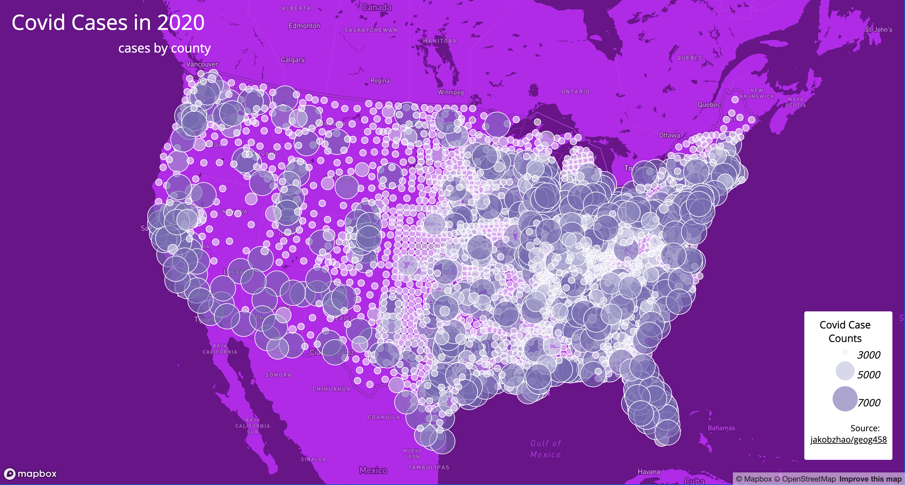

# Web_Map_Application

Project Name: GEOG 458, LAB3: Maps of the 2020 COVID rates and 2020 COVID cases 
# Introduction
For my project I aimed to visualize the US 2020 Covid rate (choropleth map)and cases (proportional map). I achieve this by obtaining the relevant data shape files from the jakobzhao/geog458 repository, which is the US Covid 2020 counts and US Covid 2020 rates. I subsequently converted these files to a JSON format.I made two different maps with this data, one showed the rate, the other showed the case. The projection for both map I used an Albers.Also, I add basemap for each map. 

# Function
I added two different kinds of interactive map features to improve interactivity. In the first map, the US 2020 Covid rates has hover  button. when you hover over an area, the Covid rates for that specific location is display. In the US 2020 Covid cases map has clickable dot. You may find specific Covid cases for a given location by clicking on a dat.

# Libraries in use
* Mapbox-gl-js
* JavaScript Library
* Use mapshaper to converted JSON files

# Links to the map can be found here:

[US 2020 Covid Rates](https://miahuang1.github.io/Web_Map_Application/map1.html)

[US 2020 Covid Cases](https://miahuang1.github.io/Web_Map_Application/map2.html)

# Screenshot 

# Data Sources
For two set of shapefiles files can be downloading at jakobzhao/geog458 repsository or The COVID-19 case/death data you will be using are originally from The New York Times. The data include all the cases in 2020. The population data used for calculating the case rates are from the 2018 ACS 5 year estimates.

# Acknowledgment

I want to acknowledge Professor Zhao and TA Liz for helping create this lab and help solve the problem when I need.

